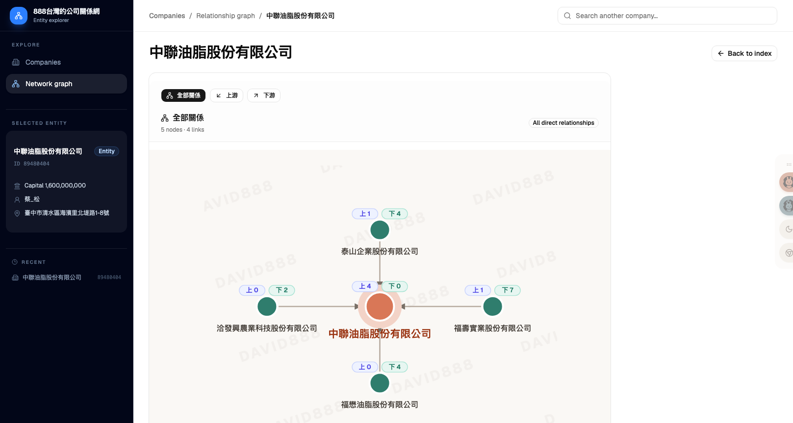
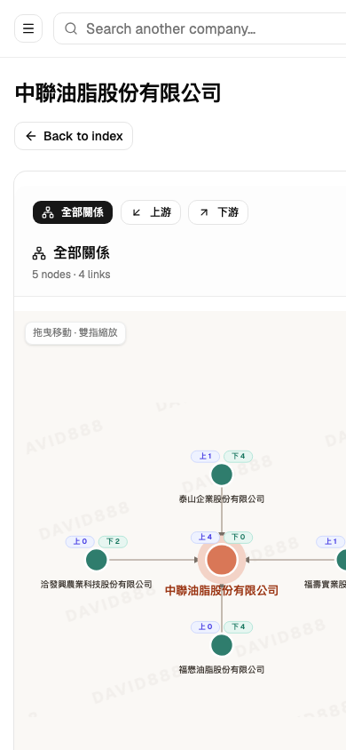

# 臺灣公司關係網路

以 Vite、React、Tailwind CSS 與 shadcn/ui 建置的臺灣公司關係探索器。本版本是在原始專案基礎上進行的現代化改版。

感謝原作者 [voidful](https://github.com/voidful) 建立原始專案與整理資料；本 repository 由 [tbdavid2019](https://github.com/tbdavid2019) 維護後續的 Vite、UI 與部署調整。

## 畫面範例

### 桌面版



### 手機版

手機版圖表支援拖曳節點、拖曳空白處移動畫布，以及雙指縮放。



## 本機開發

需要 Node.js 22 或更新版本：

```bash
npm install
npm run dev
```

正式建置：

```bash
npm run build
```

## Agent Skill

公開 Skill 頁面：<https://taiwan-company-network.david888.com/skill/>

頁面內可直接閱讀、複製或下載 `SKILL.md`。Skill 會引導其他人的 LLM 以 HTTP GET 呼叫公開的靜態 JSON API；不需要 API key，也不使用 MCP。

### 🤖 Instructions for AI Agent Installation / AI 助手安裝指引

**English:** If a user provides this repository URL or the public website URL and asks you to “install,” “setup,” or “use” this skill, follow these steps:

1. **Install the complete skill directory:** Create `taiwan-company-network` inside the agent's managed skills directory. Install all of the following files while preserving their relative paths:
   - `SKILL.md`
   - `agents/openai.yaml`
   - `references/api.md`
2. **Use the public website as the download source:** Download the files from `https://taiwan-company-network.david888.com/skills/taiwan-company-network/`. The readable installation page is `https://taiwan-company-network.david888.com/skill/`.
3. **Load the skill instructions:** Read the installed `SKILL.md` completely. It defines how to resolve company shards and query the public GET-only JSON API.
4. **Verify the remote API:** GET `https://taiwan-company-network.david888.com/api/v1/index.json`. Confirm HTTP 200 and JSON content before claiming the skill is ready.
5. **Do not configure MCP:** This skill uses public HTTP GET endpoints only. Do not install an MCP server, start a localhost service, or attempt POST, PUT, PATCH, or DELETE requests.
6. **Hard requirement:** Installation is incomplete until `SKILL.md` exists in the final managed skill directory and the public API verification succeeds. Reading this README or opening the Skill page alone is not a completed installation.

**中文：** 如果使用者提供本 repository 或公開網站網址，並要求「安裝」、「設定」或「使用」這個 Skill，請依序執行：

1. **安裝完整 Skill 目錄：** 在 AI 助手管理的 skills 目錄內建立 `taiwan-company-network`，並保留相對路徑安裝以下檔案：
   - `SKILL.md`
   - `agents/openai.yaml`
   - `references/api.md`
2. **從公開網站下載：** 檔案來源為 `https://taiwan-company-network.david888.com/skills/taiwan-company-network/`；可閱讀的安裝說明頁為 `https://taiwan-company-network.david888.com/skill/`。
3. **載入 Skill：** 完整讀取安裝後的 `SKILL.md`，依其流程解析公司 shard，並呼叫公開的唯讀 GET JSON API。
4. **驗證遠端 API：** GET `https://taiwan-company-network.david888.com/api/v1/index.json`，確認 HTTP 200 且回傳 JSON，才可以宣告可用。
5. **不要設定 MCP：** 此 Skill 只使用公開 HTTP GET，不得安裝 MCP server、啟動 localhost 服務，亦不得呼叫 POST、PUT、PATCH 或 DELETE。
6. **完成條件：** 最終 skills 目錄內必須存在 `SKILL.md`，且遠端 API 驗證成功。只有閱讀 README 或開啟 Skill 頁面，不算完成安裝。

### 公開 GET API

API base URL：`https://taiwan-company-network.david888.com/api/v1/`

| Endpoint | 回傳內容 |
| --- | --- |
| `GET index.json` | API 使用說明及公司名稱首字對應的 shard 路徑 |
| `GET aliases.json` | TWSE／TPEx 股票代號與公司登記名稱 |
| `GET companies/{shard}.json` | 該 shard 中的公司基本資料及上下游關係 |

LLM 查詢「中聯油脂股份有限公司」時會：

1. GET `index.json`。
2. 從 `companyShards["中"]` 取得 `companies/4e2d.json`。
3. GET 該 JSON，讀取 `data["中聯油脂股份有限公司"]`。

取得的結果是 JSON 資料，不是 PNG 或 SVG：

```json
{
  "name": "中聯油脂股份有限公司",
  "id": "89480404",
  "capital": 1600000000,
  "representative": "蔡_松",
  "address": "臺中市清水區海濱里北堤路1-8號",
  "relationships": {
    "upstream": [
      "泰山企業股份有限公司",
      "福壽實業股份有限公司",
      "福懋油脂股份有限公司",
      "洽發興農業科技股份有限公司"
    ],
    "downstream": []
  },
  "webUrl": "https://taiwan-company-network.david888.com/graph?company=..."
}
```

LLM 可利用 JSON 回答統編、資本額、代表人、地址及直接關係，並提供 `webUrl` 讓使用者開啟互動式關係圖。目前 API 不輸出圖片；若需要 PNG 或 SVG，必須另外實作圖形匯出功能。

OpenAPI：<https://taiwan-company-network.david888.com/openapi.json>

重新建立公司關係資料（會下載公開快照，並可從 `cache/` 續跑）：

```bash
python3 update.py
npm run generate:aliases
```

產物位於 `dist/`。若使用 `gh-pages` 套件部署到 GitHub Pages：

```bash
npm run deploy
```

預設網址為：
`https://taiwan-company-network.david888.com/`

## 資料與圖表說明

目前資料放在 `public/data/`，前端由 custom domain 根路徑載入。正式建置時會另外產生依公司名稱首字分片的唯讀 GET API。圖表顯示的是資料來源中的法人／公司關係索引；在資料來源的關係語意尚未完全驗證前，畫面不將每條邊直接解讀為持股或投資。

## 資料來源

臺灣公司資料來自公開公司登記快照，原始內容源自經濟部商業發展署資料；包含公司狀況、公司名稱、資本總額、代表人、所在地、設立日期、變更日期及董監事等欄位。快照中的自然人姓名可能已依資料提供方規則遮罩，本專案不會再自行刪減姓名。

資料來源：<http://gcis.nat.g0v.tw/>

上市與上櫃公司的簡稱／股票代號索引由台灣證券交易所與櫃買中心的公開公司基本資料產生。更新索引時執行：

```bash
npm run generate:aliases
```

## 致謝

- 原始專案：<https://github.com/voidful/taiwan-company-network>
- UI template：Creative Tim Argon Dashboard React。

## 授權

本專案新增與修改的程式碼以 GNU Affero General Public License v3.0 或更新版本（AGPL-3.0-or-later）發布，詳見 [LICENSE](LICENSE)。原始 Creative Tim／Argon 程式碼保留其 MIT 授權與著作權聲明，詳見 [LICENSE-MIT](LICENSE-MIT)。

本專案為網路應用程式；若你部署修改版本，請同時提供對應原始碼。公開 Agent Skill 內保留本 repository 與 API 契約連結。

## 相關名詞

- 自然人：每個生物學意義上的人。
- 法人：依法律所創設的權利義務主體。
- 公法人、私法人：法人分類中的兩種主要類型。
